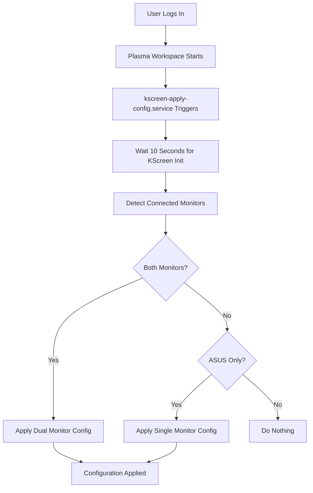

## 🎯 Overview

This document describes the declarative multi-monitor configuration system for KDE Plasma 6 on Wayland. The solution fixes the common issue where KDE resets monitor orientation, scaling, and positioning on every reboot.

**Problem Solved**: KDE Plasma on Wayland doesn't reliably persist multi-monitor configurations, especially with different scaling factors and rotation settings.

**Solution**: Systemd user service that automatically applies display configuration on login using `kscreen-doctor`, plus DDC/CI support for hardware brightness control.

---

## 🏗️ Architecture

### System Components

**Location**: `/etc/nixos/modules/desktop/kde.nix:93-150`

**Components**:
1. **Systemd User Service**: `kscreen-apply-config.service`
   - Runs on login after `plasma-workspace.target`
   - Executes as user (not root)
   - Non-blocking (Type=oneshot, RemainAfterExit=false)

2. **Shell Script**: `apply-kscreen-config`
   - Detects connected monitors
   - Applies appropriate configuration
   - Handles both dual-monitor and single-monitor scenarios

3. **Configuration Tool**: `kscreen-doctor` (from `kdePackages.libkscreen`)
   - Command-line display configuration tool
   - Supports scaling, rotation, positioning, mode setting

### How It Works



---

## 🔧 Configuration Details

### Current Setup (cmos Host)

**Monitor 1 - BenQ (HDMI-A-1)**:
- **Resolution**: 2560x1440@60Hz
- **Scaling**: 175% (1.75x)
- **Rotation**: Left (portrait mode)
- **Position**: 0,0 (top-left origin)
- **Logical Size**: 823×1463 pixels

**Monitor 2 - ASUS PB278 (DP-2)**:
- **Resolution**: 2560x1440@60Hz
- **Scaling**: 150% (1.5x)
- **Rotation**: Normal (landscape)
- **Position**: 823,0 (right of BenQ)
- **Logical Size**: 1707×960 pixels
- **Primary**: Yes

### Configuration Code

```nix
systemd.user.services.kscreen-apply-config = {
  description = "Apply KDE multi-monitor configuration on login";
  wantedBy = [ "plasma-workspace.target" ];
  after = [ "plasma-workspace.target" ];

  serviceConfig = {
    Type = "oneshot";
    RemainAfterExit = false;

    ExecStart = "${pkgs.writeShellScript "apply-kscreen-config" ''
      set -x  # Enable debug output
      sleep 10  # Wait for KScreen to initialize

      # Detect connected monitors
      OUTPUTS=$(${pkgs.kdePackages.libkscreen}/bin/kscreen-doctor -o 2>&1)
      HDMI_CONNECTED=$(echo "$OUTPUTS" | grep -c "Output.*HDMI-A-1" || true)
      DP_CONNECTED=$(echo "$OUTPUTS" | grep -c "Output.*DP-2" || true)

      if [[ "$HDMI_CONNECTED" -gt 0 && "$DP_CONNECTED" -gt 0 ]]; then
        # Both monitors - apply dual setup
        ${pkgs.kdePackages.libkscreen}/bin/kscreen-doctor \
          output.HDMI-A-1.mode.2560x1440@60 \
          output.HDMI-A-1.scale.1.75 \
          output.HDMI-A-1.rotation.left \
          output.HDMI-A-1.position.0,0 \
          output.HDMI-A-1.enable \
          output.DP-2.mode.2560x1440@60 \
          output.DP-2.scale.1.5 \
          output.DP-2.position.823,0 \
          output.DP-2.enable \
          output.DP-2.primary
      elif [[ "$DP_CONNECTED" -gt 0 ]]; then
        # ASUS only - single monitor
        ${pkgs.kdePackages.libkscreen}/bin/kscreen-doctor \
          output.DP-2.mode.2560x1440@60 \
          output.DP-2.scale.1.5 \
          output.DP-2.enable \
          output.DP-2.primary
      fi
    ''}";
  };
};
```

---

## 📐 Understanding Logical Pixels

**Critical Concept**: KDE uses **logical pixels** for positioning, not physical pixels.

### Calculation Formula

```
Logical Width = Physical Width / Scale Factor
Logical Height = Physical Height / Scale Factor
```

### Example (BenQ Monitor)

**Physical Resolution**: 2560×1440 (landscape)
**After Rotation**: 1440×2560 (portrait)
**Scale Factor**: 1.75

**Logical Size**:
- Width: 1440 ÷ 1.75 = **823 pixels**
- Height: 2560 ÷ 1.75 = **1463 pixels**

**Positioning**: To place ASUS monitor to the right of BenQ:
- ✅ Correct: `position.823,0` (uses logical width)
- ❌ Wrong: `position.1440,0` (creates gap, uses physical width)

---

## 🛠️ Customization Guide

### Adding New Monitor Configuration

1. **Identify Monitor Name**:
   ```bash
   kscreen-doctor -o
   ```
   Look for output names like `HDMI-A-1`, `DP-2`, `eDP-1`, etc.

2. **Determine Desired Settings**:
   - Resolution and refresh rate
   - Scaling factor (1.0, 1.25, 1.5, 1.75, 2.0, etc.)
   - Rotation (none, left, right, inverted)
   - Position (x,y coordinates in logical pixels)

3. **Update Configuration**:
   Edit `/etc/nixos/modules/desktop/kde.nix` lines 125-139

4. **Test Configuration**:
   ```bash
   # Apply immediately without reboot
   systemctl --user restart kscreen-apply-config

   # Check results
   kscreen-doctor -o
   ```

5. **Rebuild System**:
   ```bash
   nixos-rebuild switch --flake .#cmos
   ```

### Example: Adding Third Monitor

```bash
# Assuming third monitor is HDMI-A-2, positioned right of ASUS
output.HDMI-A-2.mode.1920x1080@60 \
output.HDMI-A-2.scale.1.0 \
output.HDMI-A-2.position.2530,0 \  # 823 (BenQ) + 1707 (ASUS) = 2530
output.HDMI-A-2.enable
```

---

## 🔍 Troubleshooting

### Check Service Status

```bash
# View service status
systemctl --user status kscreen-apply-config

# View logs from current boot
journalctl --user -u kscreen-apply-config -b 0 --no-pager

# View recent logs with debug output
journalctl --user -u kscreen-apply-config -n 100 --no-pager
```

### Common Issues

**Issue: Configuration Not Applied**
- **Symptom**: Monitors still in wrong orientation after reboot
- **Check**: Service ran successfully?
  ```bash
  systemctl --user status kscreen-apply-config
  ```
- **Solution**: Check logs for errors, verify monitor names match

**Issue: Monitors Not Detected**
- **Symptom**: Logs show "No known monitors detected"
- **Check**: Monitor names in detection logic
  ```bash
  kscreen-doctor -o | grep "Output:"
  ```
- **Solution**: Update grep patterns in script to match your monitor names

**Issue: Gap Between Displays**
- **Symptom**: Cannot drag windows between monitors
- **Check**: Position values use logical pixels?
- **Solution**: Recalculate position using logical pixel formula (see above)

**Issue: Wrong Scaling Applied**
- **Symptom**: Text too large/small on monitors
- **Check**: Scale values in configuration
- **Solution**: Adjust scale values (common: 1.0, 1.25, 1.5, 1.75, 2.0)

### Manual Testing

```bash
# Test dual monitor configuration manually
kscreen-doctor \
  output.HDMI-A-1.mode.2560x1440@60 \
  output.HDMI-A-1.scale.1.75 \
  output.HDMI-A-1.rotation.left \
  output.HDMI-A-1.position.0,0 \
  output.HDMI-A-1.enable \
  output.DP-2.mode.2560x1440@60 \
  output.DP-2.scale.1.5 \
  output.DP-2.position.823,0 \
  output.DP-2.enable \
  output.DP-2.primary

# Verify applied configuration
kscreen-doctor -o
```

---

## 🎯 kscreen-doctor Command Reference

### Basic Syntax

```bash
kscreen-doctor [output.NAME.SETTING.VALUE] [...]
```

### Common Settings

**Resolution & Refresh Rate**:
```bash
output.HDMI-A-1.mode.1920x1080@60
output.DP-2.mode.2560x1440@144
```

**Scaling** (Wayland only for fractional scaling):
```bash
output.HDMI-A-1.scale.1.5   # 150%
output.DP-2.scale.2.0        # 200%
```

**Rotation**:
```bash
output.HDMI-A-1.rotation.none      # Normal
output.HDMI-A-1.rotation.left      # 90° counter-clockwise (portrait)
output.HDMI-A-1.rotation.right     # 90° clockwise
output.HDMI-A-1.rotation.inverted  # 180°
```

**Position** (logical pixels):
```bash
output.HDMI-A-1.position.0,0      # Top-left origin
output.DP-2.position.1920,0       # Right of 1920px wide monitor
```

**Enable/Disable**:
```bash
output.HDMI-A-1.enable
output.HDMI-A-1.disable
```

**Primary Monitor**:
```bash
output.DP-2.primary
```

### Query Commands

```bash
# Show all outputs
kscreen-doctor -o
kscreen-doctor --outputs

# Show configuration in JSON
kscreen-doctor -j
kscreen-doctor --json
```

---

## 🔐 Security Considerations

**Service Runs as User**: The systemd user service runs in the user session context (nicholas), not as root. This is correct and secure.

**No Sensitive Data**: The configuration contains only display settings (public information).

**Wayland Display Access**: The service has access to `WAYLAND_DISPLAY` via the user session environment.

---

## 📖 Related Documentation

- **[KDE Desktop Overview](overview.md)** - Main KDE configuration
- **[KDE Font Optimization](kde-fonts-optimization.md)** - Font rendering setup
- **[KDE Logout Fix](kde-logout-fix.md)** - Session management fixes
- **[Troubleshooting Overview](../troubleshooting/overview.md)** - General troubleshooting

### External Resources

- **[KDE Plasma Documentation](https://docs.kde.org/stable5/en/plasma-desktop/)** - Official KDE docs
- **[kscreen-doctor Documentation](https://invent.kde.org/plasma/libkscreen)** - KScreen library
- **[Wayland Display Protocol](https://wayland.freedesktop.org/)** - Wayland overview

---

## 📝 Notes

**Fractional Scaling**: Only supported on Wayland, not X11. This configuration requires KDE Plasma on Wayland.

**Monitor Hotplug**: The service only runs on login. Plugging/unplugging monitors during a session won't trigger automatic reconfiguration. For dynamic hotplug support, KDE's built-in kscreen daemon handles that (though it may not persist settings correctly, which is why this service exists).

**Service Timing**: The 10-second delay is necessary to ensure KScreen backend is fully initialized. Reducing this may cause the configuration to fail silently.

**Debug Output**: The `set -x` in the script enables bash debug output, visible in systemd logs. This can be removed once the configuration is stable.

---

## 💡 Brightness Control via DDC/CI

**Problem**: KDE Display Configuration may show "The driver rejected the output configuration" when trying to adjust monitor brightness.

**Solution**: DDC/CI (Display Data Channel Command Interface) allows software control of monitor hardware settings.

### Requirements

**Kernel Module** (already configured):
```nix
boot.kernelModules = [ "i2c-dev" ];  # Required for DDC/CI
```

**Installed Package** (already configured):
```nix
environment.systemPackages = with pkgs; [
  ddcutil  # Monitor control via DDC/CI
];
```

### Usage

**Detect Monitors**:
```bash
ddcutil detect
```

**Get Current Brightness**:
```bash
ddcutil getvcp 10 --display 3  # Display 3 = ASUS PB278
```

**Set Brightness**:
```bash
ddcutil setvcp 10 100 --display 3  # Set to 100%
ddcutil setvcp 10 50 --display 1   # Set to 50%
```

**VCP Code Reference**:
- `10` = Brightness
- `12` = Contrast
- `14` = Color preset (temperature)

**View All Capabilities**:
```bash
ddcutil capabilities --display 3
```

### Monitor Display Numbers

From `ddcutil detect`:
- **Display 1**: /dev/i2c-5 → HDMI-A-1 (Left BenQ)
- **Display 2**: /dev/i2c-6 → DP-1 (Right BenQ)
- **Display 3**: /dev/i2c-7 → DP-2 (ASUS PB278)

### KDE Integration

After enabling `i2c-dev`, KDE Display Configuration brightness sliders should work without errors. KDE uses DDC/CI internally when available.

**Benefits**:
- ✅ No more "driver rejected" errors
- ✅ Hardware brightness control (better than software dimming)
- ✅ Per-monitor brightness adjustment
- ✅ Works in KDE GUI and command line

---

**Last Updated**: 2025-11-19
**Maintained By**: Infrastructure Team
**Tested On**: KDE Plasma 6.3.6, NixOS 25.05

---
*🏠 [Home](../README.md) | 📚 [Navigation](../NAVIGATION.md) | 🖥️ [Desktop Overview](overview.md)*
