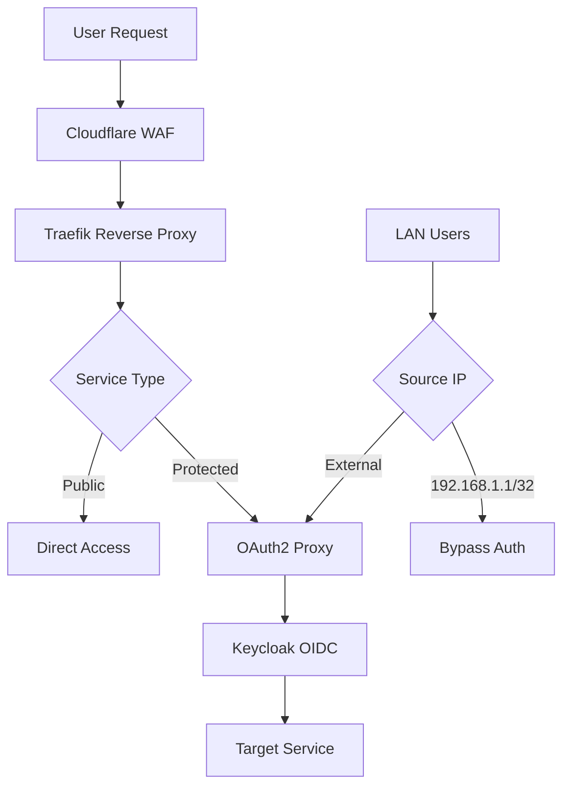

## 🎯 Security Overview

**Current Security Posture**: 9.8/10 (Maximum practical security)

Our infrastructure implements a **Zero Trust Architecture** with defense-in-depth security, ensuring every request is authenticated and authorized while maintaining usability for legitimate users.

### 🛡️ Core Security Principles

1. **Zero Trust Architecture**: Every request authenticated and authorized
2. **Defense in Depth**: Multiple security layers with no single point of failure
3. **Privacy by Design**: Minimal data collection, no unnecessary third-party calls
4. **Fail Secure**: System defaults to secure state on component failures

---

## 📚 Security Documentation Index

### 🔒 Authentication Systems
**[📁 authentication/](authentication/README.md)**

| Component | Purpose | Status | Documentation |
|-----------|---------|--------|---------------|
| **Keycloak** | Identity provider (Google SSO) | ✅ Active | [Keycloak Config](../services/keycloak.md) |
| **OAuth2 Proxy** | Service-level authorization | ✅ Active | [OAuth2 Technical](oauth2-proxy-technical-configuration.md) |
| **SSH OAuth2** | QR code SSH auth from WAN | ✅ Active | [Keycloak Config](../services/keycloak.md#ssh-oauth2-device-flow-web-realm) |
| **Traefik** | Reverse proxy + TLS | ✅ Active | [Network Security](network-security-overview.md) |

### 🔑 Secret Management
**[📁 secrets/](secrets/README.md)**

| System | Purpose | Status | Documentation |
|--------|---------|--------|---------------|
| **Agenix** | Encrypted secrets | ✅ Active | [Agenix Guide](../security/secrets-agenix.md) |
| **TruffleHog** | Secret detection/scanning | ✅ Active | [Git Secret Removal](../security/git-secret-removal.md) |
| **nuke-secret** | Remove secrets from git history | ✅ Active | [Git Secret Removal](security-git-secret-removal.md#-nuke-secret-command) |
| **1Password** | Password management | ✅ Active | Personal use only |

### 🌐 Network Security
**[📁 network-security/](network-security-overview.md)**

| Layer | Technology | Purpose | Status |
|-------|------------|---------|--------|
| **CDN** | Cloudflare | WAF + DDoS protection | ✅ Active |
| **Proxy** | Traefik | TLS termination + headers | ✅ Active |
| **IPS** | Fail2ban | Brute force protection | ✅ Active |
| **Firewall** | systemd | Port restrictions | ✅ Active |
| **IDS/IPS** | Clear NDR (Suricata) | Network threat detection | ✅ Active |

---

## 🔐 Authentication Architecture

### 🎯 Authentication Flow



### 🏠 LAN vs WAN Access Control

**LAN Bypass Rules** (Applied First):
```yaml
- domain: "service.bedrosn.com"
  policy: "bypass"
  networks: ["192.168.1.1/32"]  # Router NAT makes all LAN appear as this IP
```

**WAN Authentication** (Applied Second):
```yaml
- domain: "service.bedrosn.com"
  policy: "two_factor"
```

⚠️ **Critical**: Rule order matters! LAN bypass must come before WAN 2FA rules.

### 🔑 Authentication Methods

| Service | LAN Access | WAN Access | Emergency Bypass |
|---------|------------|------------|------------------|
| **Glances** | ✅ Direct | 🔐 OAuth2 (glances-access) | ❌ None |
| **Security Dashboard** | ✅ Direct | 🔐 OAuth2 (security-access) | ❌ None |
| **Filebrowser** | ✅ Direct | 🔐 OAuth2 (filebrowser-access) | ❌ None |
| **Cockpit** | ✅ Direct | 🔐 OAuth2 (cockpit-access) | 🔧 SSH tunnel |

---

## 🛡️ Security Layers

### 1️⃣ **Network Layer Protection**

**Cloudflare Security Features**:
- DDoS protection (unlimited)
- Web Application Firewall (WAF)
- Rate limiting and bot protection
- TLS 1.3 enforcement
- Geographic blocking capabilities

### 2️⃣ **Reverse Proxy Security**

**Traefik Security Configuration**:
- TLS 1.2+ enforcement
- Strict cipher suites
- HSTS preload headers
- Security headers (CSRF, XSS, etc.)
- Automatic certificate management

**Fail2ban Intrusion Prevention** ([Fail2ban Guide](fail2ban.md)):
- Automated brute force protection
- 7 specialized jails for Traefik
- Temporary IP bans (1-3 hours)
- Monitors OAuth2, Keycloak, rate limits, scanning
- Real-time attack mitigation
- Zero false positive rate (LAN whitelisted)

### 3️⃣ **Application Layer Security**

**Keycloak + OAuth2 Proxy Features**:
- Google OIDC federation (SSO via Google accounts)
- Group-based authorization per service
- Session management with secure cookies
- Email whitelist enforcement
- JWT token validation
- Session timeout controls
- Cookie security (HttpOnly, Secure)

### Why No VPN?

A common question: why not require a VPN for WAN access? Our setup provides equivalent (arguably stronger) protection at the application layer without one:

**Authentication gate is already airtight.** Every public service sits behind OAuth2-proxy + Keycloak with Google IDP. An attacker cannot reach any application without completing a full OAuth2 flow tied to a Google account that's explicitly whitelisted in `keycloak-user-config.age`. This is the same model GitHub, Cloudflare, and Google Cloud Console use for their dashboards.

**Minimal attack surface.** Only ports 80, 443, and 22 face the internet. Traefik terminates TLS for all web traffic — there's one entry point, not a dozen services each handling connections independently.

**Active intrusion prevention.** Fail2ban with 8 jails monitors Traefik logs in real-time, banning brute-force attempts before they can make meaningful progress. Dynamic WAN IP whitelisting ensures legitimate access isn't disrupted.

**SSH is independently hardened.** WAN SSH requires OAuth2 device flow: QR code scan, Google authentication, Keycloak verification, and PAM email check — four layers before a shell is granted.

**Hardened transport on every route.** HSTS with preload, strict CSP, anti-clickjacking headers, server fingerprint stripping, secure cookies (HttpOnly, Secure, SameSite=Lax).

**Continuous verification.** Automated Lynis audits, on-demand Nuclei/ZAP/Nmap scanning, and Clear NDR (Suricata) network monitoring actively test the perimeter.

**What a VPN would add:** hiding services from port scans. Our setup accepts that visibility (ports 80/443/22 are discoverable) while ensuring nothing behind Traefik is reachable without an authenticated session. The tradeoff is worth it — VPNs add operational friction (client setup, key management, connection issues) and create a single point of failure. Our layered approach has no single bypass.

### 4️⃣ **System Layer Security**

**NixOS Security Features**:
- Systemd service isolation
- Minimal attack surface
- Declarative configuration
- Automatic security updates
- Process sandboxing

---

## 🔒 Secret Management

### 🔐 Agenix Integration

**Architecture**:
```
secrets/
├── secrets.nix           # Public key definitions
├── *.age                # Encrypted secret files
└── keys/                # Host age keys
    ├── cmos-agenix.key
    ├── misc-agenix.key
    └── ...
```

**Secret Types**:
- **OAuth2 secrets**: Client secrets, cookie secrets
- **Database credentials**: Keycloak, application databases
- **API keys**: Cloudflare, external services
- **SSH keys**: Inter-host communication
- **TLS certificates**: Custom certificate authorities

### 🔄 Secret Rotation Schedule

| Secret Type | Rotation Frequency | Last Rotated |
|-------------|-------------------|--------------|
| OAuth2 cookie secrets | Quarterly | 2025-09-15 |
| Database passwords | Annually | 2025-01-15 |
| API keys | As needed | 2025-08-20 |
| SSH keys | 2 years | 2024-12-01 |

---

## 🚨 Security Monitoring

### 🛡️ Security Dashboard

**[Security Dashboard](../services/security-dashboard.md)** - Centralized monitoring at https://security.bedrosn.com

**Real-time Visibility:**
- Service inventory and authentication status
- User access control (Keycloak group membership)
- **Security posture scores** - Mozilla Observatory-based header analysis (0-100)
- TLS configuration and certificate validity
- Background caching for sub-second response times

### 🔍 Security Scanning

**[Security Scanning Infrastructure](scanning.md)** - Automated and on-demand vulnerability scanning

**Tools Installed:**
- **Lynis** - Automated monthly host hardening audits
- **Nmap** - Network vulnerability scanning with NSE scripts
- **OWASP ZAP** - Web application security testing (baseline/full/API)
- **Helper scripts**: `nix-vulnscan`, `nix-zapscan`

**Automation:**
- Monthly Lynis audits via systemd timer
- Dynamic WAN IP whitelisting for Fail2ban (every 30 minutes)

### 📊 Security Metrics

**Authentication Monitoring**:
- Failed login attempts
- Unusual access patterns
- Geographic anomalies
- Brute force attempts

**System Monitoring**:
- Service availability
- Certificate expiration
- Security update status
- Configuration drift

### 🔍 Log Analysis

**Key Log Sources**:
- **Keycloak/OAuth2-Proxy**: Authentication events
- **Traefik**: Access logs and security events
- **Clear NDR**: Network intrusion detection and packet analysis
- **systemd**: Service security violations
- **Cloudflare**: WAF and DDoS events

**Network Threat Detection** ([Clear NDR Guide](../guides/suricata.md)):
- **Real-time Monitoring**: Suricata IDS/IPS on enp3s0f0 interface
- **Threat Detection**: ET Open ruleset with automatic daily updates
- **Event Analysis**: OpenSearch-backed log analysis and visualization
- **Alert Management**: Scirius web UI at suricata.bedrosn.com
- **Packet Capture**: Full PCAP storage and Arkime browsing

### 📱 Alert Configuration

**Critical Alerts**:
- Multiple failed authentication attempts
- Certificate expiration (&lt; 30 days)
- Service unavailability
- Security policy violations

---

## 🔧 Security Procedures

### 🛠️ Routine Security Tasks

**Daily**:
- Monitor authentication logs for anomalies
- Check service health status
- Verify backup completion

**Weekly**:
- Review security event logs
- Test emergency access procedures
- Update documentation for changes

**Monthly**:
- Security configuration review
- Performance impact assessment
- Documentation updates

**Quarterly**:
- OAuth2 cookie secret rotation
- Comprehensive security audit
- Disaster recovery testing
- Threat model updates

### 🚨 Security Incident Response

**Immediate Response** (0-15 minutes):
1. **Containment**: Disable affected services
2. **Assessment**: Determine scope of compromise
3. **Notification**: Alert security team
4. **Logging**: Preserve evidence

**Short-term Response** (15 minutes - 4 hours):
1. **Investigation**: Analyze logs and system state
2. **Mitigation**: Implement temporary fixes
3. **Communication**: Update stakeholders
4. **Recovery**: Restore affected services

**Long-term Response** (4+ hours):
1. **Root Cause Analysis**: Determine how incident occurred
2. **Prevention**: Implement fixes to prevent recurrence
3. **Documentation**: Create detailed incident report
4. **Review**: Update security procedures

---

## 🎯 Quick Security Reference

### 🚀 Emergency Access

**Service Down**:
```bash
# Check service status
systemctl status <service>

# Review recent logs
journalctl -u <service> -n 50

# Emergency restart
systemctl restart <service>
```

**Authentication Issues**:
```bash
# OAuth2 proxy debug
journalctl -u oauth2-proxy -f

# Keycloak debug
journalctl -u keycloak -f

# Reset user session
# (Follow procedures in authentication docs)
```

**Secret Management**:
```bash
# Re-encrypt all secrets (from /etc/nixos/secrets)
nix run github:ryantm/agenix -- --rekey

# Add new secret
nix run github:ryantm/agenix -- -e new-secret.age -i ../keys/cmos-agenix.key

# Remove leaked secret from git history
nuke-secret "SECRET_VALUE_TO_REMOVE"
```

### 🔍 Security Verification

**Check Authentication**:
```bash
# Test Keycloak health
curl -I https://keycloak.bedrosn.com/realms/web

# Test OAuth2 proxy (should redirect to Keycloak)
curl -I https://glances.bedrosn.com

# Check certificate validity
openssl s_client -connect bedrosn.com:443 -servername bedrosn.com
```

**Verify Security Headers**:
```bash
# Check security headers
curl -I https://security.bedrosn.com

# Test HSTS
curl -I https://bedrosn.com | grep -i strict
```

---

## 📖 Related Documentation

### 🏗️ Infrastructure
- **[Infrastructure Overview](../infrastructure/overview.md)** - System architecture
- **[Host Configuration](../infrastructure-overview.md#host-specifications)** - Per-host security

### 🌐 Services
- **[Web Services](../services/web-services-overview.md)** - Service-specific security
- **[Monitoring](../services/monitoring/README.md)** - Security monitoring

### 🛠️ Operations
- **[Fresh Deployment](../operations/fresh.md)** - Secure deployment
- **[Best Practices](../operations/practices.md)** - Security operations

### 🚨 Troubleshooting
- **[Authentication Issues](../troubleshooting/overview.md)** - Common security problems
- **[Emergency Procedures](../troubleshooting-overview.md#emergency-procedures)** - Security incident response

---

**Last Updated**: 2025-12-05
**Security Review**: 2025-11-02
**Next Security Audit**: 2026-01-23
**Security Contact**: System Administrator via authenticated channels only

---
*🏠 [Home](../README.md) | 📚 [Navigation](../NAVIGATION.md) | 🏗️ [Infrastructure](../infrastructure/overview.md) | 🌐 [Services](../services/overview.md)*